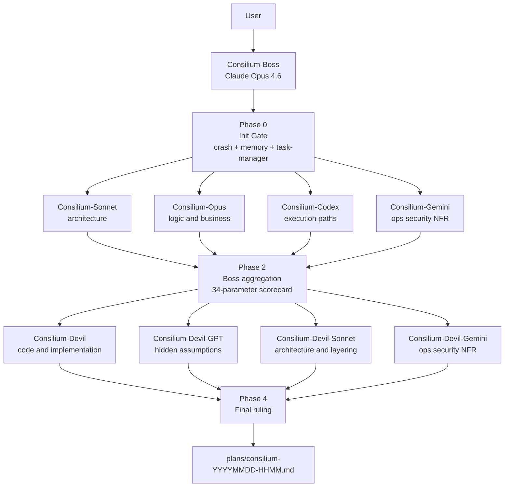
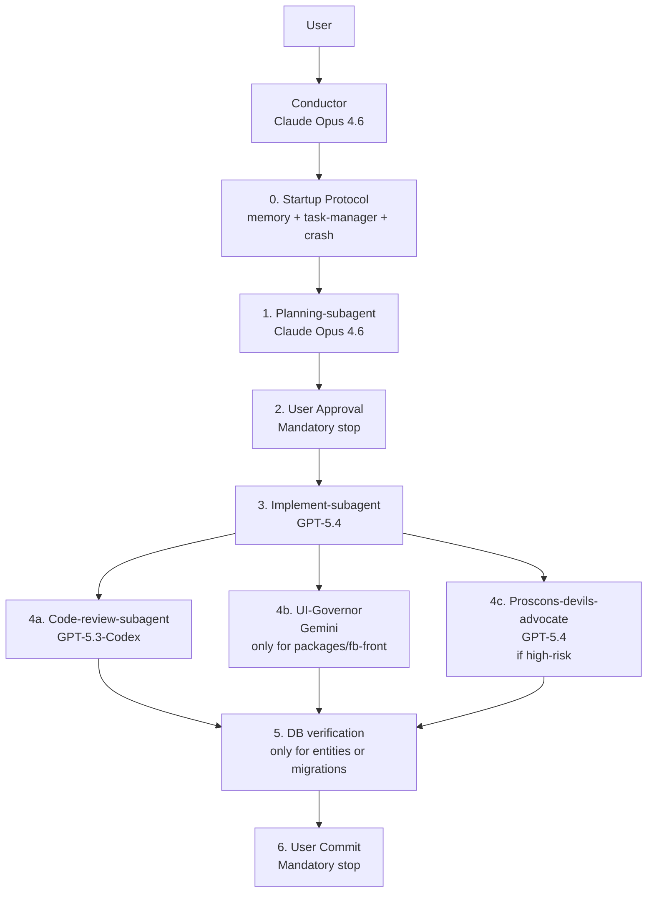
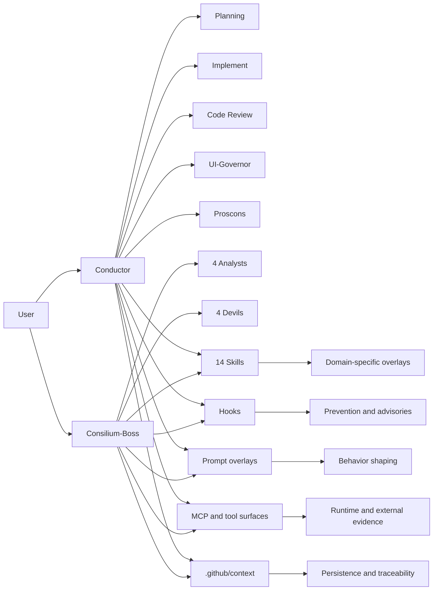

# Агентский контур Flowise

Этот документ фиксирует текущую агентную архитектуру workspace: кто кого вызывает, где обязательные stop/gate точки, какие skills и MCP задействуются, и какие служебные артефакты поддерживают контур.

Документ опирается на текущее состояние:
- `.github/agents/*.agent.md`
- `.github/instructions/code-rules.instructions.md`
- `.github/hooks/*`
- `.github/prompts/*`
- `.vscode/mcp.json`
- `.vscode/settings.json`
- `.github/context/*`

## 1. Snapshot

### Что есть сейчас

| Компонент | Факт | Примечание |
|---|---|---|
| Пользовательские контуры | 2 | `Conductor` и `Consilium-Boss` |
| Agent files | 15 | Не 16 |
| User-invocable agents | 2 | `Conductor`, `Consilium-Boss` |
| Conductor subagents | 5 | `Planning`, `Implement`, `Code-review`, `Proscons`, `UI-Governor` |
| Consilium subagents | 8 | 4 Analysts + 4 Devils |
| Skills | 13 | Включая 5 `fb-front-*` skills |
| Hooks | 3 | 1 pre-tool + 2 post-tool |
| Prompt overlays | 1 | Не отдельные агенты, а режим поведения |
| Context artifacts | 10 | 2 файла сейчас пустые |
| GitHub workflows | 4 | Это CI/CD, не оркестрация |
| MCP servers в `.vscode/mcp.json` | 13 | Локально/HTTP описанные серверы |
| Effective MCP/tool surfaces в Conductor docs | 17 | С учетом `github/*`, `github-support-docs/*`, `github-copilot/*`, `web/fetch` |

### Ключевые поправки к черновой карте

| Тема | Было в черновике | Фактически сейчас |
|---|---|---|
| Agents | 16 | 15 |
| `fb-front-*` skills | 4 | 5 |
| MCP servers | 16 | 13 в `.vscode/mcp.json`, 17 в нормативной routing-карте |
| Specialized MCP | `apify` | `figma` |

## 2. Два основных контура

### Contour A: Consilium

Назначение: независимое многомодельное совещание для сложных решений, спорных архитектур, повторяющихся багов, ситуаций с высокой неопределенностью.

### Contour B: Conductor

Назначение: production delivery cycle. Это основной build/implement/review контур с управляемыми stop-точками и субагентами по ролям.

## 3. Agent Inventory

### User-facing orchestrators

| Agent | Контур | Модель | Роль | Когда использовать |
|---|---|---|---|---|
| `Consilium-Boss` | Consilium | Claude Opus 4.6 | Оркестратор независимого совещания | Когда нужен multi-angle verdict, спорное решение, повторяющаяся проблема |
| `Conductor` | Conductor | Claude Opus 4.6 | Главный delivery orchestrator | Когда нужно провести задачу через planning, implement, review, commit gates |

### Consilium: analysts и devils

| Agent | Модель | Линза | Фаза |
|---|---|---|---|
| `Consilium-Sonnet` | Claude Sonnet 4.6 | Архитектура, структура, паттерны | Phase 1 |
| `Consilium-Opus` | Claude Opus 4.6 | Логика, бизнес, глубина reasoning | Phase 1 |
| `Consilium-Codex` | GPT-5.3-Codex | Execution paths, call chains, implementation realism | Phase 1 |
| `Consilium-Gemini` | Gemini 3.1 Pro (Preview) | Ops, security, NFR, UI/runtime evidence | Phase 1 |
| `Consilium-Devil` | GPT-5.3-Codex | Контратака по коду и реализации | Phase 3 |
| `Consilium-Devil-GPT` | GPT-5.4 | Контратака по скрытым допущениям и логике | Phase 3 |
| `Consilium-Devil-Sonnet` | Claude Sonnet 4.6 | Контратака по архитектуре и слоям | Phase 3 |
| `Consilium-Devil-Gemini` | Gemini 3.1 Pro (Preview) | Контратака по ops/security/NFR/UI evidence | Phase 3 |

### Conductor: operational subagents

| Agent | Модель | Роль | Обязательность |
|---|---|---|---|
| `Planning-subagent` | Claude Opus 4.6 | Сбор контекста и исследование | Всегда step 1 |
| `Implement-subagent` | GPT-5.4 | Код и реализация | После user approval |
| `Code-review-subagent` | GPT-5.3-Codex | Основной технический review | Всегда после implement |
| `UI-Governor` | Gemini 3.1 Pro (Preview) | UI governance для `packages/fb-front/**` | Только если есть `fb-front` scope |
| `Proscons-devils-advocate` | GPT-5.4 | Adversarial second opinion | Только при high-risk scope |

## 4. Execution Semantics

### Consilium phase model

| Фаза | Что происходит | Параллельность | Gate |
|---|---|---|---|
| Phase 0 | `crash` framing, memory retrieval, task check, skill routing | Нет | Нет |
| Phase 1 | 4 analysts запускаются изолированно | Да | Нет |
| Phase 2 | Boss aggregation и 34-параметрический scorecard | Нет | Нет |
| Phase 3 | 4 devils атакуют Boss Verdict | Да | Нет |
| Phase 4 | Final ruling и запись в `plans/consilium-*.md` | Нет | Завершение |

### Conductor phase model

| Шаг | Что происходит | Stop |
|---|---|---|
| 0 | Mandatory startup protocol: memory + task-manager + crash | Нет |
| 1 | Planning-subagent исследует scope | Нет |
| 2 | План показывается пользователю | Да, mandatory |
| 3 | Implement-subagent вносит кодовые изменения | Нет |
| 4a | Code-review-subagent проверяет корректность | Нет |
| 4b | UI-Governor проверяет `fb-front` UI/UX | Условный |
| 4c | Proscons-devils-advocate проводит adversarial pass | Условный |
| 5 | DB gate для entities/migrations/query impacts | Условный |
| 6 | Итог, commit guidance, ожидание пользователя | Да, mandatory |

## 5. Skills Routing

### Общая матрица skills

| Skill | Trigger | Основной потребитель |
|---|---|---|
| `feature-dev` | Средние и крупные feature-задачи | Planning, Implement, Consilium analysts |
| `pr-review-toolkit` | Любой review, adversarial review | Code-review, Proscons, Devils |
| `security-guidance` | Auth, secrets, validation, SQL/ORM, rendering | Implement, Review, Proscons, Gemini-lens |
| `docker-diagnostics` | Runtime bugfix, incident, containers, infra | Implement, Review, Consilium analysts/devils |
| `web-artifacts-builder` | Артефакт, прототип, demo | Implement |
| `octocode-code-forensics` | Code navigation, impact analysis, usages | Planning, Implement, Consilium, Review |
| `orchestration-qa` | Изменения `.github/agents/*`, `.github/skills/*`, `.github/mcp/*` | Code-review phase |
| `facebook-observability-lab` | Тюнинг Facebook sync/report loop, env experiments, markdown ledger, runtime evidence | Planning, Implement, Review, Consilium |
| `playwright-ui-evidence` | UI visual evidence, dev-server verification, screenshots only from the built-in browser on `cd /home/projects/new-flowise/packages/fb-front && pnpm dev` | UI-Governor, Code-review, Gemini-lens |
| `fb-front-datetime-timezone` | Даты/время в `packages/fb-front/**` | UI-Governor |
| `fb-front-design-system-builder` | Новый UI или новый screen в `fb-front` | UI-Governor |
| `fb-front-theme-darkmode` | Theme/dark mode в `fb-front` | UI-Governor |
| `fb-front-ui-consistency` | Любые visual/layout changes в `fb-front` | UI-Governor |
| `fb-front-react-practices` | React changes в `fb-front` или `whatsapp` | Implement, Review, UI-Governor |

### Важная связь

`UI-Governor` является автоматическим aggregator для всех 5 `fb-front-*` skills. То есть пользователь не вызывает эти skills напрямую. Они срабатывают как policy bundle, когда Conductor отправляет туда `packages/fb-front/**` scope.

`docker-diagnostics` теперь имеет preferred runtime-evidence path через `bash /home/projects/new-flowise/packages/vladislav/pnpm/collect-logs.sh`, который собирает единый bundle в `/home/projects/new-flowise/Zlogs.md`. Для backend/runtime scope это preferred artifact для Implement → Review → Devil handoff.

## 6. Hooks Layer

### Hooks registry

| Hook | Event | Роль |
|---|---|---|
| `pretool-guard.sh` | `PreToolUse` | Жесткая блокировка разрушительных команд |
| `posttool-quality.sh` | `PostToolUse` | Advisory quality checks по измененным файлам |
| `posttool-security.sh` | `PostToolUse` | Advisory grep на рискованные паттерны |

### Что делает каждый hook

| Hook | Фактическое поведение |
|---|---|
| `pretool-guard.sh` | Deny для `rm -rf`, destructive git (`reset`, `restore`, `clean`, `checkout --`), `mkfs`, `dd`, shutdown/reboot, а также `pnpm build:compose` и `docker compose build` |
| `posttool-quality.sh` | После edit-tools собирает список измененных файлов, запускает `prettier --check`, но не блокирует, а добавляет advisory context |
| `posttool-security.sh` | Ищет `dangerouslySetInnerHTML`, `eval`, `new Function`, `child_process.exec`, примитивные SQL string concatenations, hardcoded secrets и добавляет advisory context |

### Что это означает архитектурно

| Слой | Тип контроля |
|---|---|
| PreTool | Preventive hard guard |
| PostTool quality | Soft advisory |
| PostTool security | Soft advisory |

Иными словами: контур не полностью “policy-as-enforcement” на post-edit фазе. Он принуждает только базовую безопасность до выполнения команды, а качество и security smell после правок пока реализованы как advisory overlay, а не deny gate.

## 7. Prompt Overlays

### Что это такое

В `.github/prompts/` лежат не отдельные workflow-агенты, а operational modes, которые Conductor трактует как модификаторы поведения.

| Prompt | Смысл | Активация |
|---|---|---|
| `diagnostique.prompt.md` | Включает diagnostics-mode: deep audit + E2E chain validation + 5-колоночный issue table + обязательная техдок-валидация находок | Явный вызов prompt или фразы вроде `диагностика`, `проверь`, `проверка` |

### Связь с режимами агентов

Сейчас prompt-файл в workspace один, но поведенческих режимов в агентных инструкциях несколько:

| Режим | Где живёт | Как активируется |
|---|---|---|
| `diagnostics` | Prompt + agent instructions | `diagnostique.prompt.md` или явный запрос на диагностику |
| `deep-analysis` | Agent instructions | Фразы вроде `глубокий анализ`, `full audit`, `максимально детально` |
| `business-table` | Agent instructions | Фразы вроде `в таблице`, `по-человечески` |
| `scorecard=true` | Agent instructions | Явный флаг `scorecard=true` |

### Важное правило

Conductor не вызывает prompt-файл рекурсивно. Он читает его как intent overlay и применяет режим к своему поведению и формату ответа.

## 8. MCP Topology

### Важное различие: физические и эффективные MCP

| Категория | Что считается |
|---|---|
| Physical workspace MCP | То, что реально описано в `.vscode/mcp.json` |
| Effective orchestration MCP/tool surface | То, что Conductor нормирует как доступные внешние surfaces, включая GitHub toolsets и `web/fetch` |

### Physical MCP servers в `.vscode/mcp.json`

| Сервер | Тип | Назначение |
|---|---|---|
| `crash` | stdio | Structured reasoning |
| `task-manager` | stdio | Persistent task control plane |
| `memory` | stdio | Semantic memory |
| `context7` | stdio | External library docs |
| `kaggle` | http | Data science and benchmark references |
| `chrome-devtools` | stdio | Browser runtime evidence |
| `playwright` | stdio | UI automation |
| `octocode` | stdio | Code forensics |
| `postgres` | stdio | DB read-only query surface |
| `pgtuner` | stdio | DB performance diagnostics |
| `filesystem` | stdio | Bulk workspace FS operations |
| `mcp-files` | stdio | Surgical single-file ops |
| `figma` | http | Design-to-code and design inspection |

### Effective MCP/tool surfaces в routing-модели Conductor

| Кластер | Surfaces | Кто использует |
|---|---|---|
| Core trio | `crash`, `task-manager`, `memory` | Boss, Conductor, ключевые subagents |
| Evidence/Research | `postgres`, `pgtuner`, `context7`, `octocode` | Planning, Review, Consilium |
| UI evidence | `chrome-devtools`, `playwright`, `figma` | UI-Governor, Gemini-lens, Review |
| Platform | `github/*`, `github-support-docs/*`, `github-copilot/*`, `kaggle` | Conductor, Planning, Review, Proscons |
| Utility | `filesystem`, `mcp-files`, `web/fetch` | Conductor и ad-hoc chat work |

### Routing semantics

| Surface | Тип включения |
|---|---|
| `crash`, `task-manager`, `memory` | Базовый always-on layer |
| `postgres`, `pgtuner` | Triggered by DB/entity/migration/query scope |
| `context7` | Triggered by external library uncertainty |
| `octocode` | Triggered by code navigation and impact analysis |
| `chrome-devtools`, `playwright` | Triggered by UI/runtime evidence needs |

### Preferred runtime evidence artifact

| Артефакт | Источник | Когда использовать |
|---|---|---|
| `/home/projects/new-flowise/Zlogs.md` | `bash /home/projects/new-flowise/packages/vladislav/pnpm/collect-logs.sh` | Backend/runtime bugfix, post-implementation validation, review gate, devil/runtime challenge |

### Other selective surfaces

| Surface | Когда использовать |
|---|---|
| `figma` | Только для design-comparison и design-to-code flows |
| `kaggle` | Только для benchmark/data/model questions |
| `filesystem`, `mcp-files` | Только когда built-in file/search tools недостаточны |

## 9. MCP Sampling Policy

В `.vscode/settings.json` теперь настроен `chat.mcp.serverSampling`, и он привязан к фактической карте агентов и моделей.

### Принцип

Для каждого MCP в sampling whitelist включены только те model IDs, которые реально могут вызвать этот MCP через агентную схему.

### Примеры

| MCP | Модели |
|---|---|
| `figma` | Только Gemini, потому что фактически используется `UI-Governor` |
| `octocode` | Только Opus trio, потому что в sampling-карте он оставлен под Conductor orchestration |
| `chrome-devtools` | Opus, Codex, GPT-5.4, Gemini |
| `task-manager` | Opus и Sonnet |

## 10. Context Artifacts

### Фактический набор `.github/context/*`

| Файл | Статус | Назначение |
|---|---|---|
| `db-schema.json` | Active | Снимок БД/схемы |
| `entities.json` | Active | Снимок entity-структур |
| `migrations.json` | Active | Снимок миграций |
| `project-tree.md` | Active | Снимок структуры проекта |
| `consilium-pixel-timeout-48443.md` | Active | Task-specific context artifact |
| `dynamic-conditions.json` | Empty `[]` | Зарезервировано, сейчас не используется |
| `.last-update-ide.txt` | Active | Технический маркер обновления |

### Как это связано с контурами

| Артефакт | Кто использует |
|---|---|
| `project-tree.md` | Planning, Review, structural verification |
| `db-schema.json`, `entities.json`, `migrations.json` | Planning, Implement, Review, DB gate |
| `dynamic-conditions.json` | Потенциальный expansion point, сейчас фактически idle |

## 11. Workflows

### Что есть в `.github/workflows`

| Workflow | Роль |
|---|---|
| `main.yml` | Основной CI pipeline |
| `docker-image-dockerhub.yml` | Публикация Docker image |
| `docker-image-ecr.yml` | Публикация Docker image в ECR |
| `test_docker_build.yml` | Проверка Docker build |

### Почему это важно

Эти workflow не являются частью агентной оркестрации. Это отдельный CI/CD слой. Агентный контур лишь должен уважать их существование и не запускать Docker rebuild локально без явного разрешения пользователя.

## 12. Dependency Graph Between Components

## 13. Operational Truths

### Что является обязательным

| Обязательство | Где нормируется |
|---|---|
| Русский язык общения | `code-rules.instructions.md` |
| No destructive rollback/reset | `code-rules` + все agent files |
| No Docker rebuild without explicit approval | `code-rules` + hooks + agents |
| Startup through `memory + task-manager + crash` | `Conductor.agent.md` |
| User approval before implementation | `Conductor.agent.md` |
| User approval before commit | `Conductor.agent.md` |
| `UI-Governor` only for `packages/fb-front/**` | `Conductor.agent.md` + `UI-Governor.agent.md` |
| Consilium analysts must be isolated | `Consilium-Boss.agent.md` |

### Что является условным

| Компонент | Когда включается |
|---|---|
| `UI-Governor` | Только `fb-front` scope |
| `Proscons-devils-advocate` | Только high-risk tasks |
| DB gate (`postgres` + `pgtuner`) | Только entities/migrations/DB-sensitive changes |
| `playwright-ui-evidence` | Только при необходимости UI evidence; проверка изменений во фронте только во встроенном браузере через `cd /home/projects/new-flowise/packages/fb-front && pnpm dev` |
| `figma` | Только если есть Figma URL или design comparison |

## 14. Когда какой контур выбирать

| Ситуация | Рекомендуемый контур |
|---|---|
| Нужно реализовать задачу end-to-end | `Conductor` |
| Нужно принять сложное решение до реализации | `Consilium-Boss` |
| Баг повторяется, и single-agent reasoning уже не помогает | `Consilium-Boss` |
| Нужно исследование, реализация, review, commit handoff | `Conductor` |
| Нужно оспорить уже выбранное решение | `Consilium-Boss` |
| Нужно качественно прогнать UI governance для `fb-front` | `Conductor` с `UI-Governor` |

## 15. Текущая зрелость контура

### Сильные стороны

| Область | Сильная сторона |
|---|---|
| Оркестрация | Есть явные роли и stop-gates |
| Multi-model | Разделены аналитика, реализация, review и adversarial critique |
| Policy | Глобальные запреты продублированы в `code-rules`, agents и hooks |
| UI governance | Есть выделенный `UI-Governor` с design, theme, datetime, Figma policy |
| Traceability | Есть `.github/context/*`, task manager и embedding-memory |

### Ограничения

| Область | Ограничение |
|---|---|
| Hooks | Post-edit checks advisory, а не hard deny |
| Context artifacts | `dynamic-conditions.json` пока не интегрирован в активный workflow |
| MCP accounting | Нужно помнить разницу между 13 physical servers и 17 effective surfaces |
| Sampling | Sampling-карта точная, но зависит от текущей агентной маршрутизации и должна поддерживаться при будущих изменениях |

## 16. Краткий итог

В репозитории сейчас работают два независимых, но совместимых контура:

| Контур | Функция |
|---|---|
| `Consilium` | Принятие сложных решений через изолированное multi-model deliberation |
| `Conductor` | Управляемое проведение задачи через planning, implementation, review и user gates |

Все остальные компоненты являются поддерживающими слоями:

| Слой | Роль |
|---|---|
| Agents | Исполнительные и аналитические роли |
| Skills | Domain overlays и routing policy |
| Hooks | Safety и post-edit advisories |
| Prompts | Режимы поведения |
| MCP | Evidence и внешние поверхности |
| Context | Persistence и traceability |
| Workflows | Отдельный CI/CD слой |
