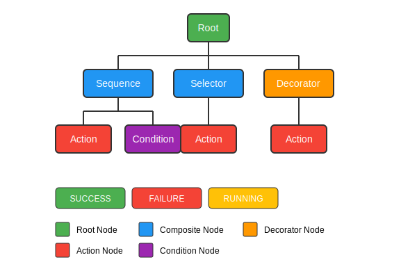
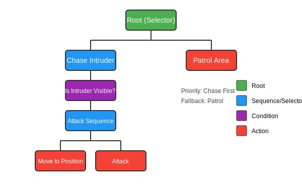

# What are Behavior Trees?

Behavior Trees are a way to organize AI logic that makes complex behaviors easier to understand, modify, and reuse. Think of them as flowcharts for decision-making that your game characters follow.

## Why Use Behavior Trees?

Imagine you're creating an enemy for your game. You could use:

- **Simple if/else statements**: Easy for basic behaviors, but quickly becomes messy for complex AI
- **State machines**: Good for distinct states, but transitions become unwieldy as behaviors grow
- **Behavior Trees**: Excellent for complex decision-making with a visual, hierarchical structure

Behavior trees offer several key advantages:

- **Visual Clarity**: The tree structure makes it easy to understand the flow of decisions at a glance
- **Modularity**: You can reuse behaviors across different characters (e.g., the same "search for item" behavior for different NPCs)
- **Maintainability**: Easy to modify and extend without breaking existing functionality
- **Scalability**: Works well for both simple and complex AI behaviors

## Basic Structure Explained

A behavior tree is like a decision tree with specialized nodes:

- **Root**: The starting point of the tree (like the trunk of a tree)
- **Composite Nodes**: Control the flow by managing multiple child nodes (like branches that split)
  - Example: "First check if enemy is visible, then attack, then celebrate"
- **Decorator Nodes**: Modify the behavior of their child node (like ornaments on a branch)
  - Example: "Invert the result" or "Repeat this action 3 times"
- **Leaf Nodes**: Perform actual actions or check conditions (like leaves at the end of branches)
  - Example: "Move to position" or "Is health low?"

## How It Works: The Tick System

Behavior trees operate using a "tick" system:

1. Every frame (or at specified intervals), the behavior tree receives a "tick" signal
2. This tick travels down the tree, starting from the root
3. Each node processes the tick and decides which children to tick based on its logic
4. When a leaf node receives a tick, it performs its action or check
5. Each node returns one of three status codes:

Status | Meaning | Real-world Example
---|---|---
**SUCCESS** | The task completed successfully | "I found the treasure!"
**FAILURE** | The task could not be completed | "The door is locked, can't open it"
**RUNNING** | The task is still in progress | "Still walking to the destination..."

## Real-World Example: Guard AI

Let's look at a concrete example - a guard in your game:

The guard's behavior can be described as:

1. The guard checks if an intruder is visible
   - If YES: Move to attack position, then attack
   - If NO: Continue patrolling
2. If attacking fails (intruder runs away), retreat to safety

In code terms:
- The root Selector tries to execute "Chase Intruder" first
- If the "Is Intruder Visible?" condition fails, it falls back to "Patrol Area"
- If the intruder becomes visible during patrol, it switches to chase on the next tick

This simple structure creates a guard that dynamically responds to the game world!

## Comparison to Everyday Thinking

Behavior trees mirror how we make decisions in real life:

When I get home from work (Selector):
  If I'm hungry (Sequence):
    Check if there's food in the fridge
    If yes

## Next Steps

Now that you understand the basic concept of behavior trees, let's explore the [Core Concepts](core_concepts.md) of Beehave and then build [Your First Behavior Tree](first_behavior_tree.md).