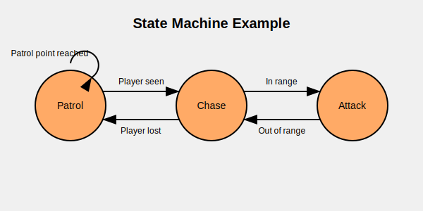
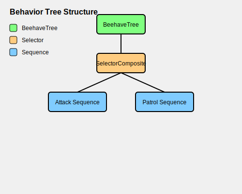

# Behavior Trees vs. State Machines vs. If-Else Logic

When implementing AI for your game, you have several approaches to choose from. This guide compares three common techniques: behavior trees, state machines, and simple if-else logic.

## Simple If-Else Logic

The most basic approach to game AI is using if-else statements to control behavior.

```gdscript
func update_enemy(delta):
    # Check if player is visible
    if is_player_visible():
        # Check if in attack range
        if distance_to_player() < attack_range:
            attack_player()
        else:
            move_toward_player()
    else:
        patrol()
```

### Pros
- Simple to implement for basic behaviors
- No extra frameworks or systems required
- Fast execution for simple cases
- Easy to understand for beginners

### Cons
- Becomes unwieldy as complexity increases
- Hard to maintain and debug large if-else chains
- Difficult to reuse code across different AI entities
- No visualization of logic flow
- State transitions can become messy and error-prone

### When to Use
- Prototyping simple behaviors
- Very simple AI with few states/behaviors
- When you need a quick solution without learning a new system

## State Machines

State machines organize behavior into distinct states with clear transitions between them.



### Pros
- More organized than if-else chains
- Clearly defined states and transitions
- Easier to debug (current state is always known)
- Moderate complexity with reasonable scalability
- Can be visualized as flow charts

### Cons
- Becomes complex with many states and transitions
- Transitions between states can still become messy
- Difficulty implementing parallel behaviors
- Tends to have lots of transition conditions
- Less flexible than behavior trees for complex AI

### When to Use
- AI with well-defined, distinct states
- When transitions between behaviors are straightforward
- Characters that need to react to player input with predictable responses
- When behavior tree complexity isn't needed

## Behavior Trees

Behavior trees organize AI into a hierarchical tree structure with specialized node types.



### Pros
- Highly modular and reusable components
- Excellent for complex decision making
- Natural handling of fallback behaviors
- Support for parallel actions
- Visual representation aids understanding
- Scalable to very complex AI
- Easier to maintain as complexity grows

### Cons
- Steeper learning curve
- Slight overhead for very simple AI
- Requires planning the tree structure
- May need custom nodes for specific behaviors

### When to Use
- Complex AI with many behaviors and conditions
- When you need reusable behavior modules across different entities
- When fallback behaviors are important
- When parallel actions are needed
- Projects that will grow in complexity over time

## Feature Comparison

| Feature | If-Else Logic | State Machines | Behavior Trees |
|---------|---------------|---------------|----------------|
| Complexity | Low | Medium | High |
| Scalability | Poor | Moderate | Excellent |
| Reusability | Poor | Moderate | Excellent |
| Readability | Poor (as it grows) | Good | Good |
| Parallel Actions | Difficult | Difficult | Built-in |
| Visualization | None | Flow charts | Tree structure |
| Debugging | Difficult | Moderate | Built-in tools |
| Memory Usage | Low | Low | Medium |
| Learning Curve | Minimal | Moderate | Steeper |
| Maintainability | Poor | Moderate | Good |

## Hybrid Approaches

Many games use hybrid approaches, combining techniques:

- Using behavior trees for high-level decision making with state machines for specific actions
- Implementing simple behaviors with if-else logic but complex behaviors with behavior trees
- Using state machines for animation control while behavior trees handle decision making

## Selection Guide

Choose **simple if-else logic** when:
- You're prototyping or creating a game jam project
- Your AI is extremely simple (e.g., "move toward player if seen")
- You have tight performance constraints for very simple entities

Choose **state machines** when:
- Your AI has clear, distinct states with straightforward transitions
- You need more organization than if-else chains, but don't need the full power of behavior trees
- You're building a character controller responsive to player input

Choose **behavior trees** when:
- Your AI needs complex decision making with many conditions
- You want to reuse behavior components across different entities
- You need to implement parallel actions (like moving while shooting)
- Your project will grow in complexity over time
- You want better tools for debugging AI behavior
- Your AI needs to gracefully fall back to alternative behaviors when preferred actions fail

## Conclusion

There's no one-size-fits-all solution for game AI. Consider your specific needs, project scope, and the complexity of behaviors required. For many modern games with sophisticated AI requirements, behavior trees offer the best combination of power, flexibility, and maintainability—which is why Beehave exists to make their implementation easier in Godot. 