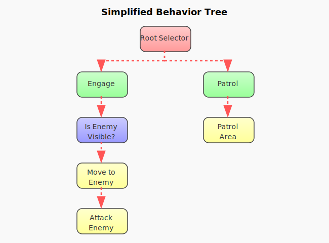

# Core Concepts in Beehave

Before diving into creating behavior trees, let's understand the fundamental concepts that make up the Beehave system.

## The Three Status Codes

Every node in a behavior tree returns one of three status codes:

- **SUCCESS**: The node has completed its task successfully and achieved its goal
- **FAILURE**: The node has failed to complete its task or its conditions weren't met
- **RUNNING**: The node is still working on its task and needs more time to complete

These status codes propagate up the tree and determine how parent nodes behave. When a node returns RUNNING, it will be revisited on the next tick until it returns SUCCESS or FAILURE.

## Node Types

Beehave provides several types of nodes that serve different purposes:

### Leaf Nodes

Leaf nodes are at the ends of branches and perform actual actions or check conditions:

- **Action Nodes**: Perform actions like "Move to position", "Attack enemy", or "Play animation". These nodes do the actual work and can return any of the three status codes.
- **Condition Nodes**: Check conditions like "Is enemy visible?", "Is health low?", or "Is item available?". These nodes typically return SUCCESS if the condition is true and FAILURE if it's false.

### Composite Nodes

Composite nodes control the flow by managing multiple child nodes:

- **Sequence**: Executes children in order until one fails (AND logic). Returns SUCCESS only if all children succeed. If any child fails, the sequence stops and returns FAILURE.
- **Selector**: Executes children in order until one succeeds (OR logic). Returns SUCCESS if any child succeeds. If all children fail, the selector returns FAILURE.
- **Simple Parallel**: Executes two children simultaneously - typically a main task and a background task. The node can be configured to succeed when the main task succeeds or when both tasks succeed. See [Simple Parallel](simple_parallel.md) for more details.

### Decorator Nodes

Decorator nodes modify the behavior of their single child node:

- **Inverter**: Reverses the result (SUCCESS becomes FAILURE and vice versa)
- **Succeeder**: Always returns SUCCESS regardless of the child's result
- **Failer**: Always returns FAILURE regardless of the child's result
- **Limiter**: Limits how many times a node can be executed
- **Repeater**: Repeats a node multiple times
- **UntilFail**: Continues executing its child until the child returns FAILURE

Decorators are perfect for modifying behavior without changing the underlying nodes. For example, an Inverter turns "Is Enemy Visible" into "Is Enemy Not Visible" without creating a new condition.

## The Blackboard

The Blackboard is a shared memory space that nodes can use to store and retrieve information. Think of it as a central database where your AI behaviors can communicate with each other.

### Key Blackboard Concepts

- **Data Sharing**: The blackboard allows different parts of the behavior tree to exchange information
- **Persistence**: Data remains on the blackboard between ticks, serving as the AI's memory
- **Scoping**: Blackboard data can be scoped to specific trees or branches (see [Blackboard](blackboard.md))

### Blackboard Example

A behavior tree for an enemy character might use the blackboard like this:

1. A perception node finds the player and writes:
   ```gdscript
   blackboard.set_value("player_position", player.global_position)
   blackboard.set_value("player_detected", true)
   ```

2. Later, a movement node reads this data:
   ```gdscript
   var target = blackboard.get_value("player_position")
   # Move toward target...
   ```

3. And a combat node might check:
   ```gdscript
   if blackboard.get_value("player_detected", false):
       # Attack player...
   ```

Using the blackboard this way keeps your nodes decoupled and reusable.

## How Execution Works

Understanding how behavior trees execute is crucial:

1. Every tick (usually every frame), the tree starts execution from the root node
2. The root node ticks its children according to its type (Sequence, Selector, etc.)
3. Execution continues down the tree until leaf nodes are reached
4. Leaf nodes perform actions or check conditions and return a status
5. The status propagates back up the tree, determining which nodes execute next

This continual reevaluation allows the AI to respond to changing conditions in the game world.

### Execution Modes

Beehave trees can run in three different modes, controlled by the `process_thread` property:

- **PHYSICS** (default): The tree ticks automatically during the physics process, making it ideal for physics-based behaviors like movement and combat
- **IDLE**: The tree ticks automatically during the idle process, better suited for UI or non-physics behaviors
- **MANUAL**: The tree only ticks when you explicitly call the `tick()` method, giving you full control over when behaviors execute

#### Manual Mode Use Cases

Manual mode is particularly useful in scenarios where you want precise control over when behaviors execute:

- **Turn-Based Games**: In games like roguelikes or strategy games, you might want behaviors to execute only when it's a character's turn
- **Event-Driven Systems**: When behaviors should only run in response to specific events rather than every frame
- **Performance Optimization**: For behaviors that don't need to run every frame, you can manually control the tick rate
- **Synchronized Behaviors**: When multiple trees need to execute in a specific order or at the same time

Example of manual mode in a roguelike:
```gdscript
# In your turn manager
func process_turn():
    for character in characters:
        character.behavior_tree.tick()
```

### Execution Example

Consider this sequence: "Check if enemy is visible" → "Move to enemy" → "Attack enemy"

- On the first tick, if "Check if enemy is visible" returns FAILURE, the entire sequence fails
- If it returns SUCCESS, "Move to enemy" executes and might return RUNNING
- On subsequent ticks, the sequence resumes at "Move to enemy" until it succeeds
- Only then does "Attack enemy" execute

## Visual Example

Here's a visualization of how a simple behavior tree executes:



In this example:
1. The Root Selector first tries its left child (the Engage sequence)
2. The Engage sequence checks its children in order:
   - First, it evaluates "Is Enemy Visible?" condition
   - If successful, it proceeds to "Move to Enemy" action
   - If that succeeds, it executes the "Attack Enemy" action
   - The sequence succeeds only if all three nodes succeed
3. If any part of the Engage sequence fails (e.g., enemy not visible), the Root Selector will try its right child
4. The Patrol sequence then executes its "Patrol Area" action

The diagram uses different colored arrows to represent execution status:
- Red dashed lines show the execution path
- Green arrows indicate SUCCESS returns
- Red arrows indicate FAILURE returns
- Blue arrows indicate RUNNING status

This continual decision-making allows the AI to respond dynamically - attacking when enemies are visible, and patrolling otherwise.

## Interrupts

Interrupts are a critical mechanism in behavior trees that prevent "stale branches" and ensure proper cleanup of node states. A branch becomes stale when it is no longer visited during execution but might still have nodes in the RUNNING state.

### The Problem of Stale Branches

Stale branches commonly occur in several scenarios:

1. **In reactive sequences**: When using a `SequenceReactiveComposite` that always restarts from the beginning, later children that were previously RUNNING might get abandoned if an earlier condition fails.

2. **When conditions change**: In a sequence where all nodes were succeeding, if a node suddenly starts failing, subsequent nodes might have accumulated state that needs to be reset.

3. **When switching between branches in selectors**: When a `SelectorReactiveComposite` switches from one branch to another due to changing conditions, the previously running branch needs proper cleanup.

4. **During random execution**: When using `SelectorRandomComposite` or `SequenceRandom` nodes, different execution paths may be chosen on subsequent ticks, abandoning previously running branches.

5. **In parallel execution**: When using `SimpleParallel` nodes where both main and background tasks might be running simultaneously, one might need to be interrupted when the other completes.

6. **With decorator-altered flow**: Decorators like `Repeater`, `UntilFail`, or `Limiter` can create scenarios where interruption is needed when they force early termination or repetition of their child nodes.

7. **When the tree is disabled**: If the entire behavior tree is disabled or the game object is deactivated while nodes are in the RUNNING state.

> **Note:** Random nodes (`SelectorRandomComposite` and `SequenceRandom`) do not support interrupts in the current version of Beehave.

### The `interrupt()` Method

To address these issues, every node in Beehave implements an `interrupt()` method. When called, this method:

- Cleanly terminates any ongoing operations
- Resets internal state variables
- Propagates the interrupt to all children

The behavior tree system automatically calls `interrupt()` on branches that are no longer being visited, ensuring that no node is left in an inconsistent state.

### Example: Enemy Attack with Cooldown

Here's an example of how interrupts help manage an enemy's attack behavior:

```gdscript
class_name AttackWithCooldown
extends ActionLeaf

var cooldown_timer: float = 0.0
var is_attacking: bool = false

func tick(actor: Node, blackboard: Blackboard) -> int:
    if is_attacking:
        # Currently in attack animation
        if actor.animation_finished():
            is_attacking = false
            cooldown_timer = 2.0  # Start cooldown
            return SUCCESS
        return RUNNING
        
    if cooldown_timer > 0:
        # In cooldown
        cooldown_timer -= get_process_delta_time()
        return RUNNING
    
    # Ready to attack
    actor.play_attack_animation()
    is_attacking = true
    return RUNNING

func interrupt(actor: Node, blackboard: Blackboard) -> void:
    # Clean up state when the node is interrupted
    is_attacking = false
    cooldown_timer = 0.0
    # Additional cleanup like stopping animations could go here
```

In this example, if the player leaves the enemy's attack range (causing a condition node to fail), the `interrupt()` method will be called on our `AttackWithCooldown` node. This ensures the cooldown and attack state are properly reset, preventing situations where the enemy might be stuck in an invisible cooldown when the player returns to range.

### When Interrupts Are Called

Interrupts are automatically triggered when a branch becomes "unreachable" - that is, when the flow of execution will no longer visit certain nodes that were previously running. Based on the actual implementation in Beehave's composite nodes, interrupts are called in these specific scenarios:

1. **Backward jumps in execution flow**: 
   - In `SequenceComposite` nodes: When a child fails, and this failure occurs earlier in the sequence than the previous failure
   - In `SelectorComposite` nodes: When a child succeeds, and this success occurs earlier in the selector than the previous success

2. **Branch switching**:
   - When a `SelectorComposite` or `SelectorReactiveComposite` switches from one branch to another due to changing conditions
   - When one branch of a selector succeeds, making other branches unreachable

3. **Flow resets**:
   - When a `SequenceReactiveComposite` receives a RUNNING status and needs to restart execution
   - When a reactive node pattern forces re-evaluation of earlier conditions

4. **Tree-level changes**:
   - When the entire behavior tree is disabled
   - When a branch is explicitly skipped due to higher-level node behavior

## Common Patterns

Some useful behavior tree patterns include:

- **Guard Pattern**: A condition followed by an action in a sequence, ensuring the action only runs when the condition is met
- **Priority Selector**: Arranging options in order of preference using a selector
- **State Machine**: Using selectors and sequences to model different states and transitions

## Performance Tips

- Avoid expensive operations in frequently-executed conditions
- Use the Limiter decorator for operations that don't need to run every tick
- Keep your trees organized and not too deep for better debugging

Now that you understand the core concepts, let's move on to [creating your first behavior tree](first_behavior_tree.md) or learn more about [blackboards](blackboard.md).