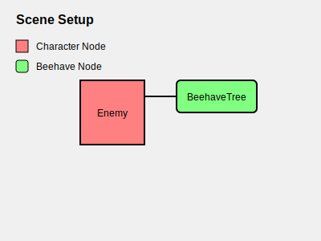
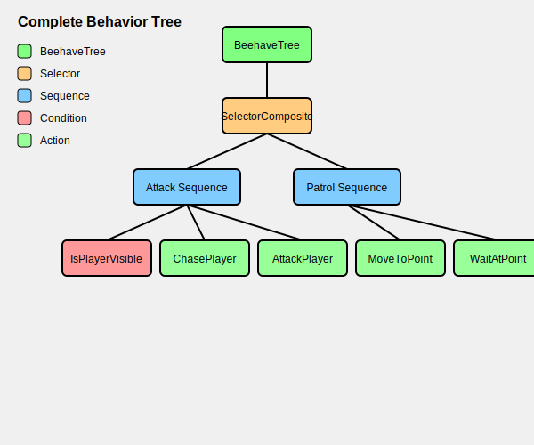
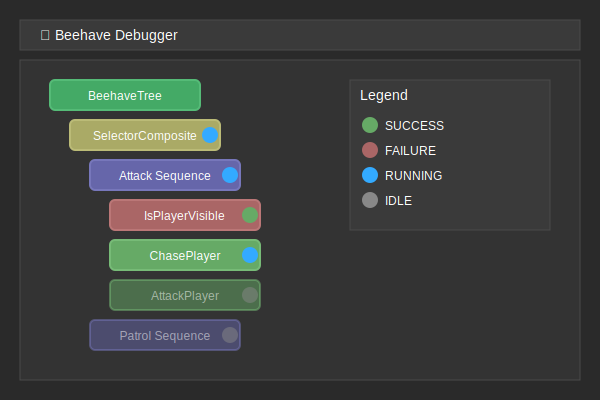

# Your First Behavior Tree

Let's create a simple behavior tree for an enemy character that either chases and attacks the player when they're visible, or patrols when they're not.

## Step 1: Set Up Your Scene

First, create a basic scene with:
- An enemy character (any Node2D or Node3D)
- A BeehaveTree node attached to the enemy



## Step 2: Design Your Behavior Tree

Before coding, it helps to sketch out your behavior tree. Here's what we'll build:

```
SelectorComposite (Choose between attacking or patrolling)
├── SequenceComposite (Attack sequence)
│   ├── IsPlayerVisibleCondition (Check if player is visible)
│   ├── ChasePlayerAction (Move toward the player)
│   └── AttackPlayerAction (Attack when in range)
└── SequenceComposite (Patrol sequence)
    ├── MoveToNextPatrolPointAction (Move to patrol point)
    └── WaitAtPatrolPointAction (Wait for a moment)
```

This tree will make the enemy:
1. First try to attack the player if they're visible
2. If the player isn't visible, fall back to patrolling behavior

Let's implement this tree step by step.

## Step 3: Create the Behavior Tree Structure

1. Add a BeehaveTree node to your enemy character
2. Add a SelectorComposite as the root node of the tree
3. Add two SequenceComposite nodes as children of the Selector

Your tree structure should look like this:


## Step 4: Create the Condition Node

Let's start by creating a condition to check if the player is visible:

1. Create a new script called `is_player_visible.gd`:

```gdscript
class_name IsPlayerVisible
extends ConditionLeaf

@export var player_detection_range: float = 200.0
@export var vision_cone_angle: float = 45.0  # degrees

func tick(actor: Node, blackboard: Blackboard) -> int:
    # Get player reference (could be cached in blackboard)
    var player = get_tree().get_first_node_in_group("player")
    if not player:
        return FAILURE
    
    # Calculate distance and direction to player
    var to_player = player.global_position - actor.global_position
    var distance = to_player.length()
    
    # Check if player is within detection range
    if distance > player_detection_range:
        return FAILURE
    
    # Check if player is within vision cone
    var forward_dir = Vector2.RIGHT.rotated(actor.rotation)
    var angle_to_player = forward_dir.angle_to(to_player.normalized())
    if abs(angle_to_player) > deg_to_rad(vision_cone_angle):
        return FAILURE
    
    # Player is visible, save position in blackboard
    blackboard.set_value("player_position", player.global_position)
    blackboard.set_value("player_detected", true)
    return SUCCESS
```

2. Add this condition as a child of the Attack Sequence

## Step 5: Create the Action Nodes

Now, let's create the action nodes for chasing and attacking:

1. Create `chase_player.gd`:

```gdscript
class_name ChasePlayer
extends ActionLeaf

@export var move_speed: float = 100.0
@export var attack_range: float = 30.0

func tick(actor: Node, blackboard: Blackboard) -> int:
    # Get the player position from the blackboard
    var player_pos = blackboard.get_value("player_position")
    if not player_pos:
        return FAILURE
    
    # Calculate direction to player
    var direction = (player_pos - actor.global_position).normalized()
    
    # Move toward player
    actor.global_position += direction * move_speed * get_physics_process_delta_time()
    
    # Store attack range in blackboard
    blackboard.set_value("attack_range", attack_range)
    
    # Check if within attack range
    var distance = actor.global_position.distance_to(player_pos)
    if distance <= attack_range:
        return SUCCESS
    
    # Still chasing
    return RUNNING
```

2. Create `attack_player.gd`:

```gdscript
class_name AttackPlayer
extends ActionLeaf

@export var attack_cooldown: float = 1.0
var time_since_last_attack: float = 0.0

func tick(actor: Node, blackboard: Blackboard) -> int:
    # Check if cooldown has elapsed
    if time_since_last_attack < attack_cooldown:
        time_since_last_attack += get_physics_process_delta_time()
        return RUNNING
    
    # Reset cooldown
    time_since_last_attack = 0.0
    
    # Perform attack
    print("Enemy attacks player!")
    # In a real game, you might trigger an animation or spawn a projectile here
    
    return SUCCESS
```

3. Add these action nodes as children of the Attack Sequence

## Step 6: Create the Patrol Behavior

Now let's implement the patrol behavior:

1. Create `move_to_patrol_point.gd`:

```gdscript
class_name MoveToPatrolPoint
extends ActionLeaf

@export var patrol_points: Array[NodePath]
@export var move_speed: float = 50.0
@export var point_reach_distance: float = 10.0

var current_point_index: int = 0

func tick(actor: Node, blackboard: Blackboard) -> int:
    # Make sure we have patrol points
    if patrol_points.size() == 0:
        return FAILURE
    
    # Get the current patrol point
    var target_node = get_node(patrol_points[current_point_index])
    if not target_node:
        return FAILURE
    
    # Calculate direction to the point
    var target_pos = target_node.global_position
    var direction = (target_pos - actor.global_position).normalized()
    
    # Move toward the patrol point
    actor.global_position += direction * move_speed * get_physics_process_delta_time()
    
    # Rotate to face direction
    actor.rotation = lerp_angle(actor.rotation, atan2(direction.y, direction.x), 0.1)
    
    # Check if we've reached the point
    var distance = actor.global_position.distance_to(target_pos)
    if distance <= point_reach_distance:
        # Move to the next patrol point
        current_point_index = (current_point_index + 1) % patrol_points.size()
        blackboard.set_value("patrol_point_reached", true)
        return SUCCESS
    
    return RUNNING
```

2. Create `wait_at_patrol_point.gd`:

```gdscript
class_name WaitAtPatrolPoint
extends ActionLeaf

@export var wait_time: float = 2.0
var current_wait_time: float = 0.0

func tick(actor: Node, blackboard: Blackboard) -> int:
    # Check if we just reached the patrol point
    if blackboard.get_value("patrol_point_reached", false):
        blackboard.set_value("patrol_point_reached", false)
        current_wait_time = 0.0
    
    # Increment wait time
    current_wait_time += get_physics_process_delta_time()
    
    # Check if we've waited long enough
    if current_wait_time >= wait_time:
        return SUCCESS
    
    return RUNNING
```

3. Add these action nodes as children of the Patrol Sequence

## Step 7: Complete the Behavior Tree

1. Create a new script for your enemy that extends CharacterBody2D (or CharacterBody3D for 3D):

```gdscript
extends CharacterBody2D

@onready var beehave_tree = $BeehaveTree

# Add patrol points to the scene
@onready var patrol_point1 = $PatrolPoint1
@onready var patrol_point2 = $PatrolPoint2

func _ready():
    # Make sure to add your enemy to a group if needed for conditions
    add_to_group("enemies")
    
    # Set up patrol points in the move_to_patrol_point script
    var patrol_script = $BeehaveTree/SelectorComposite/PatrolSequence/MoveToPatrolPoint
    patrol_script.patrol_points = [patrol_point1.get_path(), patrol_point2.get_path()]

func _physics_process(delta):
    # The behavior tree handles the movement logic, but you might need
    # additional code for animation, etc.
    pass
```

2. Add the BeehaveTree node and its children to your enemy scene:



## Step 8: Add Debug Visualization

To see how your behavior tree is functioning during runtime:

1. Run your scene with the enemy and player
2. Open the Debugger panel in Godot
3. Go to the "🐝 Beehave" tab
4. Select your enemy's behavior tree from the list

You should see a live visualization of which nodes are active, running, succeeded, or failed:



## Next Steps

Now that you have a basic behavior tree working, you can:

- Add more sophisticated conditions and actions
- Try different composite patterns
- Add decorator nodes to modify behavior
- Use the blackboard to share more information between nodes

Check out the [Common Patterns & Examples](/manual/common_patterns.md) section for more ideas, or learn about [Debugging](/manual/debugging.md) to fine-tune your behavior trees. 