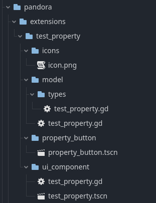

# Custom Extensions

Pandora allows you to extend its property system with your own custom property types.
This can be useful when you want to define specific data structures for your game,
such as recipes, drops, or status effects.

## Registering a Custom Extension
To register a new custom property, create a new folder within the **pandora/extensions** folder with the following structure:
_pandora/extensions/new_custom_property_:
- **icons**: This folder is <u>optional</u>, but it could be useful if you want to add icons. The name of this folder is not mandatory; it could also be called assets.
- **model**: This is a required folder. The name must match this one. Inside it, you will create a .gd file that will represent the data model used within and outside of Pandora's ecosystem.
    - **types**: Inside the model folder, the types folder must be created. Inside it, you will create a .gd file that <u>extends PandoraPropertyType</u>, which contains the settings, serialization, and deserialization of the new property.
- **property_button**: This is a required folder where you will create a file called property_button.tscn, which will be a <u>PandoraPropertyButton</u> that can be used by the Pandora bar.
- **ui_component**: Mandatory folder, here you will create the scene that will be displayed when you want to use the new custom property.

Once your extension is registered, it will automatically appear in the Pandora property selector, allowing you to use it in your entities and access it at runtime like any other Pandora property.

**NOTE**: If you want to add or change the extensions folder, just go to **Project/Project Settings/Pandora/Config** and set _Extensions_ array.

## Example
For a complete and working example of a custom property, take a look at **pandora/extensions/test_property**

